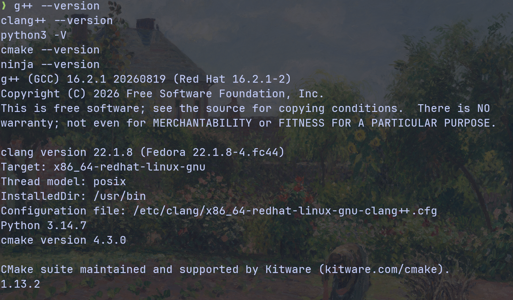
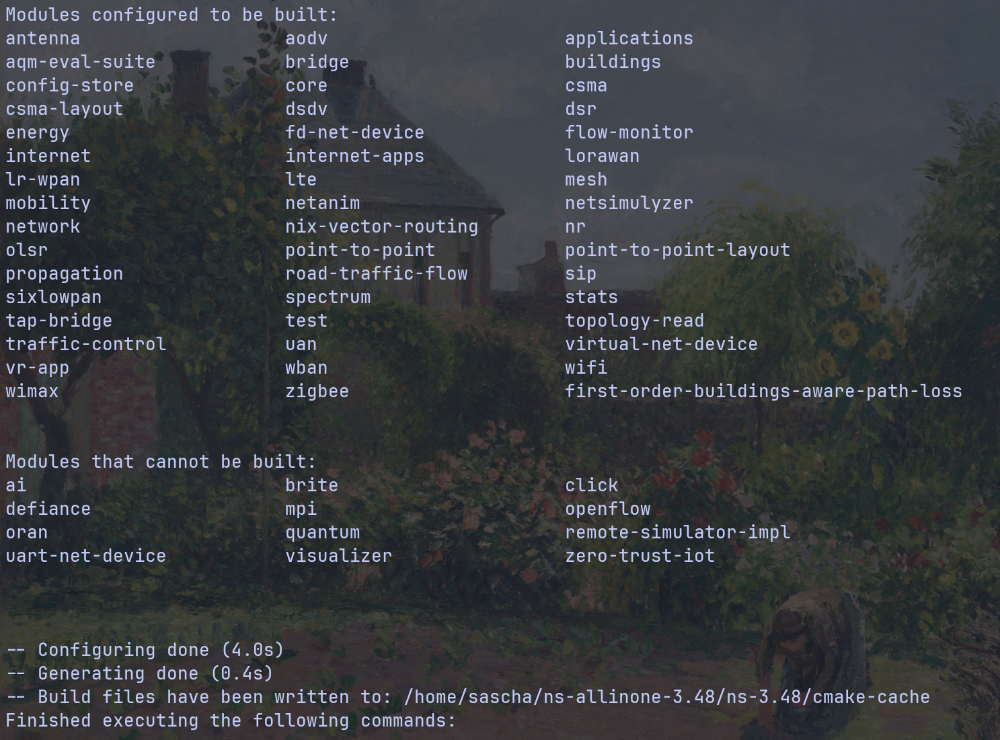
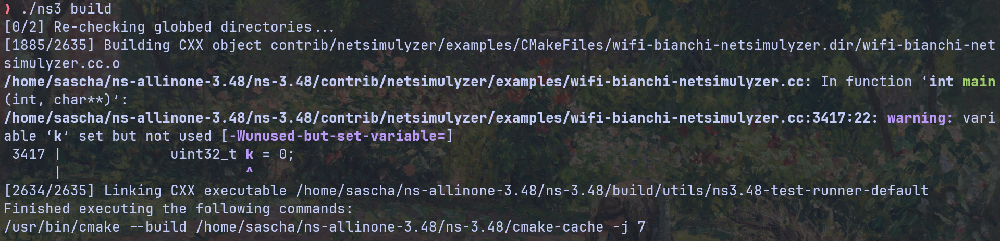
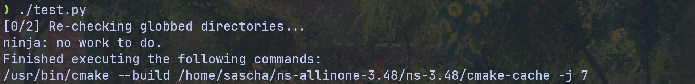
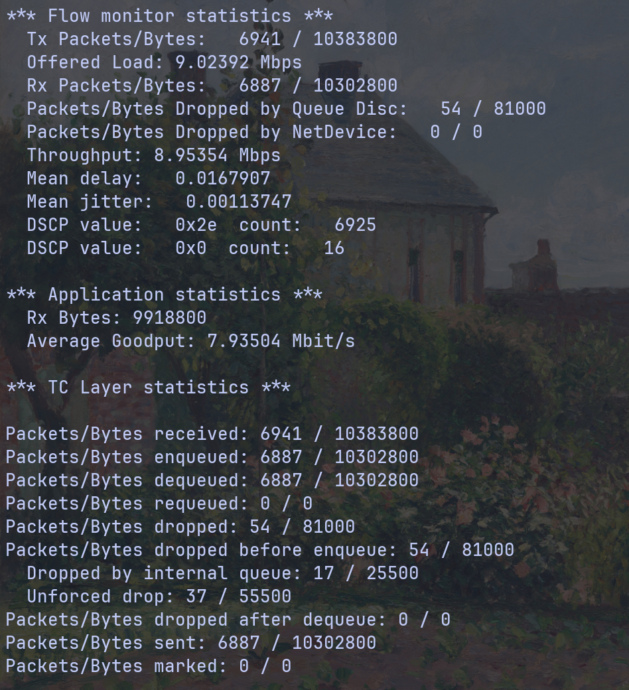

# <center>A2 — ns-3 Setup & First Scenario</center>
- [A2 — ns-3 Setup \& First Scenario](#a2--ns-3-setup--first-scenario)
  - [1. ns-3 Setup](#1-ns-3-setup)
    - [1.1 Prerequisits](#11-prerequisits)
    - [1.2 installation](#12-installation)
    - [1.3 building and testing](#13-building-and-testing)
      - [1.3.1 Running an example script](#131-running-an-example-script)
  - [2. First Scenario](#2-first-scenario)


## 1. ns-3 Setup
<!--TODO:
- installation process
- version
- plattform

- what broke
-->


used the offical [installation guide](doc/ns-3-installation.pdf) from the [ns-3 website](https://www.nsnam.org/documentation/) for the most current version (ns-3.48)

used Version: ns-3.48

Operating System: Fedora Linux 44
KDE Plasma Version: 6.7.5
KDE Frameworks Version: 6.30.0
Qt Version: 6.11.2
Kernel Version: 7.2.7-200.fc44.x86_64 (64-bit)
Graphics Platform: Wayland
Processors: 8 × 11th Gen Intel® Core™ i7-1165G7 @ 2.80GHz
Memory: 32 GiB of RAM (31.1 GiB usable)
Graphics Processor: Intel® Iris® Xe Graphics
Manufacturer: LENOVO
Product Name: 20XXS33900
System Version: ThinkPad X1 Carbon Gen 9


### 1.1 Prerequisits
| Purpose | Tool | Minimum Version |
| :--- | :--- | :--- |
| Download | git or tar and bunzip2 | No minimum version|
| Compiler | g++ or clang++ | >= 11.1 or >= 17 |
| Configuration | python3 | >= 3.10 |
| Build system | cmake, and at least one of: make, ninja, or Xcode |>= 3.25 and No minimum version |





### 1.2 installation
```
$ wget https://www.nsnam.org/releases/ns-allinone-3.48.tar.bz2
$ tar -xjf ./Downloads/ns-allinone-3.48.tar.bz2
$ cd ns-allinone-3.48/ns-3.48/
```

additionally Wireshark was installed thorugh the default Fedora package manger
```
sudo dnf install wireshark
```
### 1.3 building and testing
Configuration from the installation guide:
```
$ ./ns3 configure --enable-examples --enable-tests
```



first build:
```
$ ./ns3 build
```



Running Unit Test:
```
$ ./test.py
```




#### 1.3.1 Running an example script

Using the provided traffic-control example
```
$ ./ns3 run examples/traffic-control/traffic-control-example.cc
```


I found no documented expected output for the provided examples, so I gave Claude the example code and output to confirm. According to the Opus 5.5 Model the output is within the expectations, which confirms that the installation was successfull. 


## 2. First Scenario

